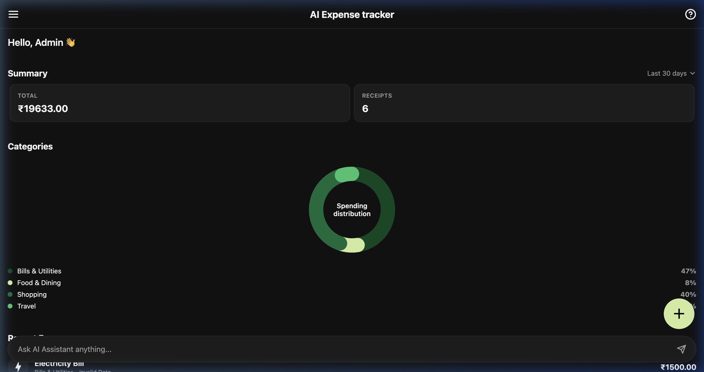

# 💸 AI Expense Tracker

A full-stack mobile application that uses Artificial Intelligence to extract structured expense information from natural language inputs ("Uber 350", "Spent 1000 on pizza").

## ✨ Project Demo


### 📱 Dashboard Preview (Dark Mode)


## 🛠 Tech Stack
- **Backend**: Node.js, Express, TypeScript, `better-sqlite3`
- **Mobile SDK**: React Native, Expo, TypeScript 
- **AI Processing**: OpenAI / Groq

## 🚀 Setup Instructions

1. **Clone & Setup Folders**
   Ensure you have configured the `ai-expense-tracker` monorepo structure containing `backend` and `mobile` subfolders.

2. **Run the Backend**
   ```bash
   cd backend
   npm install
   # Add your OpenAI/Groq keys in the .env file!
   npm run dev
   ```
   *The server dynamically creates the SQLite database internally via better-sqlite3.*

3. **Run the React Native Mobile App**
   ```bash
   cd mobile
   npm install
   npx expo start
   ```
   *Press `i` to run iOS Simulator, `a` for Android Emulator, or scan the QR Code via the Expo Go app.*

## 🧠 AI Prompt Architecture
We utilized the `response_format: { type: 'json_object' }` feature built into JSON-Mode equipped models (GPT-3.5+, Llama3+ via Groq). The prompt enforces strict constraint adherence directly rejecting payloads lacking an initial quantitative element. 

Validation occurs both at the Prompt Level, and manually via TS conditionals ensuring maximum stability preventing erroneous data storage.

## ⚡️ Quick Testing Inputs
- *"uber 350 to airport"* ➝ (Expected) `350`, `Transport`, `uber`
- *"netflix subscription 649"* ➝ (Expected) `649`, `Entertainment`, `netflix`
- *"coffee yesterday"* ➝ (Expected) `API Rejection: Amount Missing`

## 🔮 Future Improvements
1. **Categorical Charting**: Add Recharts or Victory Native pie charts for aggregations.
2. **Auth Layer**: Integrate JWTs linked securely via context.
3. **Database Migration Sync**: Switch default SQLite instance to an edge database like Turso.
